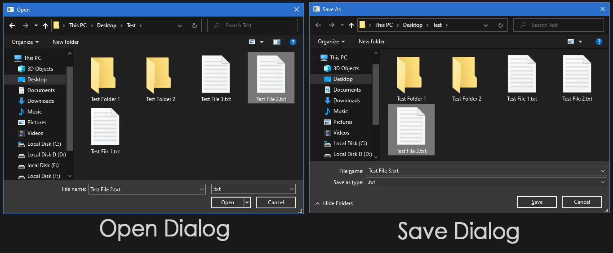
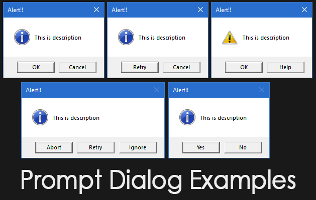

# File Dialog and Prompt CPP

## File Dialog
This example uses <commdlg.h> header to create file dialog in c++

## Prompt/Message window
This example uses <WinUser.h> header to create Prompt/Message Window in c++
